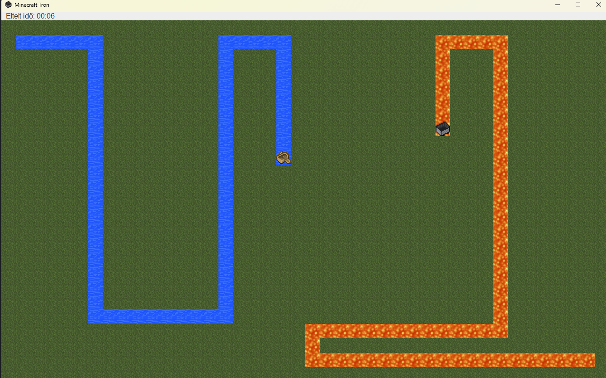
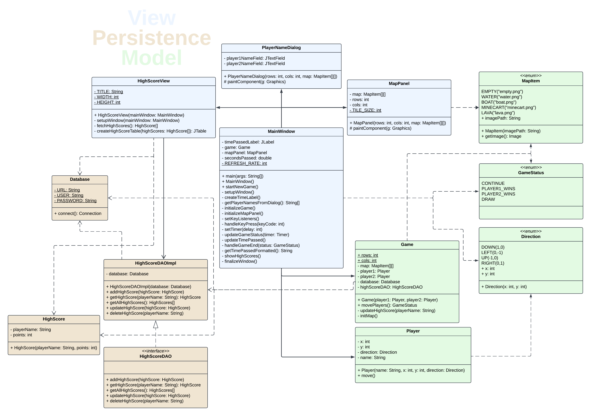

# 🎮 Minecraft Tron (Game Project)

This project was developed as a **university assignment**, focusing on creating a multiplayer game with a **graphical user interface**. The design ensures an engaging user experience while meeting specific game development criteria.

## 🚀 Features

- **Multiplayer Support**: Allows two players to compete against each other.
- **Graphical User Interface**: Interactive and visually appealing game interface.
- **High Score Tracking**: Records and displays high scores using a MySQL database.
- **Java Swing Framework**: Utilizes Java Swing for the user interface.
- **Custom Game Logic**: Tailored game mechanics specifically for this project.

## 📋 Project Details

- **University**: ELTE
- **Year**: 2024
- **Technologies**: Java, MySQL, Swing

## 📸 Preview

## 📚 Documentation

Comprehensive documentation is available, detailing the usage, code, and development process of the project.

---

⭐ This was a university project and is not actively maintained.

